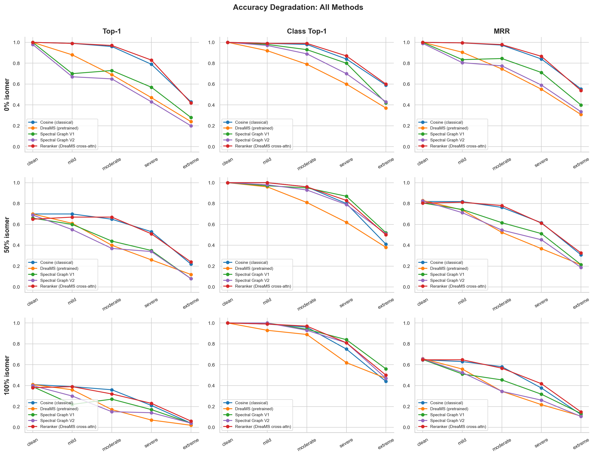
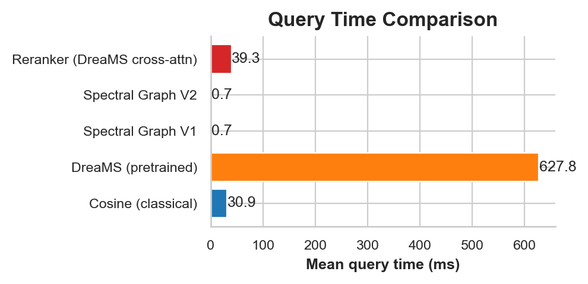

# Lipid identification from MS2 spectra

## Problem

Given an unknown MS2 spectrum, find its best match in a reference library of ~554K LipidBlast spectra. The system has to handle noisy queries, isomeric ambiguity, and return results in under a second. Clean matching is already solved (cosine similarity gets 100%). What's harder is degradation under realistic conditions: measurement noise, peak dropout, and structurally similar isomers that fragment almost identically.

## Data

**Reference library.** LipidBlast 2022: 551,890 in-silico MS2 spectra across 77 lipid classes, roughly split between positive (280K) and negative (272K) ion modes with 3 adduct types. Precursor m/z ranges from 152 to 2015 Da. Every spectrum has an associated SMILES structure.

**Spectra are extremely sparse.** Median 5 peaks per spectrum (range 2-14). Typical metabolomics spectra have 50-200 peaks. With so few peaks, compressing a spectrum into a single embedding vector is inherently lossy.

**Intensities are categorical.** Only ~7 discrete intensity tiers (1%, 5%, 10%, 20%, 30%, 50%, 100%) account for >86% of all peaks. This is an in-silico artifact; real instruments produce continuous signals. Intensity-based features carry far less information here than in experimental libraries.

**Massive template degeneracy.** 551,890 spectra collapse to just ~423 unique intensity templates. Within each (lipid_class, adduct) group, thousands of spectra share byte-identical relative intensities and differ only in m/z positions. TG [M+NH4]+, for instance, has 9 unique templates covering all its spectra. The identification problem is almost entirely about matching peak *positions*, not intensity patterns.

**Positional isomers are spectrally indistinguishable.** ~65% of spectra belong to isomer groups (same formula + adduct + mode, >1 member). I spot-checked 200 groups and all 200 had byte-identical spectra. No spectral method can distinguish these. You'd need retention time, ion mobility, or something else entirely.

## Data pipeline

**Training split.** 80/10/10 train/val/test by InChIKey (compound-level), stratified by lipid class. All adducts of a given compound stay in the same split to prevent leakage.

**Evaluation sets.** Three eval sets of 500 queries each at different difficulty levels:
- **0% isomer** — queries with no spectral isomers in the library (singletons). A correct method should get 100% on clean queries here.
- **50% isomer** — half singletons, half from isomer groups.
- **100% isomer** — all queries have spectrally identical isomers. This establishes the information-theoretic ceiling.

Each eval set is augmented at 5 noise levels: clean (unmodified), mild (0.005 Da m/z noise, 10% peak dropout), moderate (0.01 Da, 20% dropout, noise peaks), severe (0.02 Da, 30% dropout, precursor noise), extreme (0.05 Da, 50% dropout, heavy noise). Noise is applied per-peak: Gaussian m/z jitter, uniform intensity scaling, stochastic peak dropout (always keeping base peak), and random noise peaks scaled to spectrum size.

**Precomputed embeddings.** DreaMS reference embeddings (551K x 1024) and ChemBERTa molecular embeddings (551K x 768) are computed once and cached as numpy arrays.

## Approach

I followed an ablation ladder, where each method builds on what the previous one got wrong:

1. **Cosine similarity** (no training) — peak-by-peak comparison with precursor filtering. The accuracy floor.
2. **DreaMS** (pretrained, no training) — frozen transformer encoder from the Pluskal Lab, FAISS retrieval in 1024-d embedding space. Tests whether a general-purpose spectral encoder transfers to lipid retrieval.
3. **Spectral graph encoder** (custom, ~1 hr training) — dense attention network treating peaks as graph nodes with mass-difference edge features. Trained with multi-teacher distillation and contrastive learning.
4. **Cross-attention reranker** (custom, ~30 min training) — reranks cosine's top-50 candidates using cross-attention between query and candidate spectra, with DreaMS embeddings as auxiliary features.

## Methods

**Cosine similarity.** Precursor m/z filter (+-0.5 Da) narrows 554K candidates to ~hundreds, then modified cosine scoring with 0.02 Da fragment tolerance. No learning, purely algorithmic.

**DreaMS spectrum-to-spectrum.** Each spectrum goes through a frozen DreaMS transformer to produce a 1024-d vector. All reference embeddings are precomputed and indexed via FAISS. Query embedding is compared by cosine dot product. The encoder was pretrained on diverse mass spectra, not lipid-specific ones.

**Spectral graph encoder.** Each spectrum becomes a fully-connected graph with peaks as nodes and a virtual precursor node:

- *Node features (6-dim):* log10(m/z+1), relative intensity, sqrt(relative intensity), m/z ratio to precursor, log neutral loss to precursor, is-virtual flag. The virtual node encodes precursor info with intensity=1 and is-virtual=1.
- *Edge features (25-dim):* log mass difference (1), mass difference sign (1), mass ratio (1), 21 binary neutral-loss flags (|mass_diff - known_NL| < 0.02 Da for 21 known lipid neutral losses: H2O, NH3, CO, CO2, fatty acid chains C14:0-C22:6, headgroup losses), and is-to-virtual flag (1). Self-loop features are zeroed.
- *Architecture:* 6-layer edge-conditioned dense transformer (d_model=256, 8 heads, ~5.1M params). Each layer does multi-head attention where keys and values are augmented by edge features: Q_i * (K_j + E_ij), sum over V_j + E_ij. Dual readout: attention-pooled peak nodes concatenated with the virtual node hidden state, projected to 512-d and L2-normalized.
- *Batching:* Zero-padded dense tensors (B, N_max, ...) with boolean node masks. No PyG dependency.
- *Training:* Three losses: MSE alignment to ChemBERTa molecular embeddings (x1.0), asymmetric InfoNCE contrastive loss where noisy views retrieve clean anchors (x0.2, tau=0.07), and decaying MSE distillation to DreaMS spectral embeddings (0.3 -> 0 at 60% of training). Noise curriculum: mild/moderate for the first 5 epochs, then all four levels. AdamW lr=3e-4, cosine decay, batch_size=2048, 30 epochs.

**Cross-attention reranker.** Takes cosine's top-50 candidates and scores each (query, candidate) pair. Peak sequences are augmented with DreaMS embeddings. Multi-head cross-attention allows direct peak-to-peak comparison with learned importance weights. Same late-interaction advantage that makes cosine strong, but with richer features.

## Results

*Figure 1. Top-1 accuracy, class-level top-1 accuracy, and MRR across noise levels (columns) and isomer difficulty (rows).*

### 0% isomer eval set — top-1 accuracy

| Method | Clean | Mild | Moderate | Severe | Extreme | Query (ms) |
|---|---|---|---|---|---|---|
| Cosine (classical) | 1.00 | 0.99 | 0.96 | 0.79 | 0.43 | 30 |
| DreaMS (pretrained) | 1.00 | 0.88 | 0.69 | 0.47 | 0.24 | 628 |
| Spectral Graph V1 | 1.00 | 0.70 | 0.73 | 0.57 | 0.28 | 0.7 |
| Reranker (cross-attn) | 1.00 | 0.99 | 0.97 | 0.83 | 0.42 | 39 |

*Figure 2. Mean query latency. The graph encoder is 50x faster than cosine; the reranker adds ~9 ms overhead.*

## What I found

The reranker wins. On 0% isomer queries, it matches or beats cosine at every noise level (97% at moderate noise vs. cosine's 96%) and runs at 39 ms/query, comparable to cosine's 30 ms.

Bi-encoder approaches underperform cosine on LipidBlast, which I didn't expect going in. Both graph encoder variants get 100% on clean queries but fall off faster under noise. The reason: with only ~5 peaks and categorical intensities, a single embedding vector can't hold onto the fine-grained peak positions that late-interaction methods preserve.

Isomer disambiguation is information-theoretically hard. At 100% isomer difficulty, all methods converge to ~40% top-1 accuracy even on clean queries. Positional isomers produce identical fragments, and no amount of modeling fixes that. You'd need retention time or ion mobility. Class-level accuracy stays near 100%, though, so the system still gets the lipid class right.

On speed: the graph encoder at 0.7 ms/query (50x faster than cosine) with competitive class-level accuracy works well as a pre-filter. The reranker at 39 ms/query gives the best accuracy. DreaMS at 628 ms/query doesn't justify the wait.

## Design decisions

**Why an ablation ladder?** Cosine shows that peak-level comparison is already strong on sparse lipid spectra. DreaMS shows that pretrained embeddings don't transfer well here. The graph encoder shows that learned representations capture class structure but lose fine positional detail. The reranker takes what works from cosine (peak precision) and adds learned features on top.

**Why cross-attention reranking instead of a better bi-encoder?** ~5 peaks per spectrum. A single embedding vector just can't hold the exact m/z positions that distinguish compounds. Cross-attention sidesteps this by comparing peaks directly, and it only needs to rerank cosine's top-50, so latency stays low.

**Why train on ChemBERTa targets?** The molecular alignment loss pushes spectra from the same compound closer together. ChemBERTa captures structural similarity beyond what spectral features alone can — that's why class-level accuracy holds up even when exact-match accuracy drops.

**Why noise curriculum?** Throwing aggressive augmentation at the model from epoch 0 prevents it from learning clean spectral structure. Mild/moderate noise first, all levels later. Structure first, robustness second.
